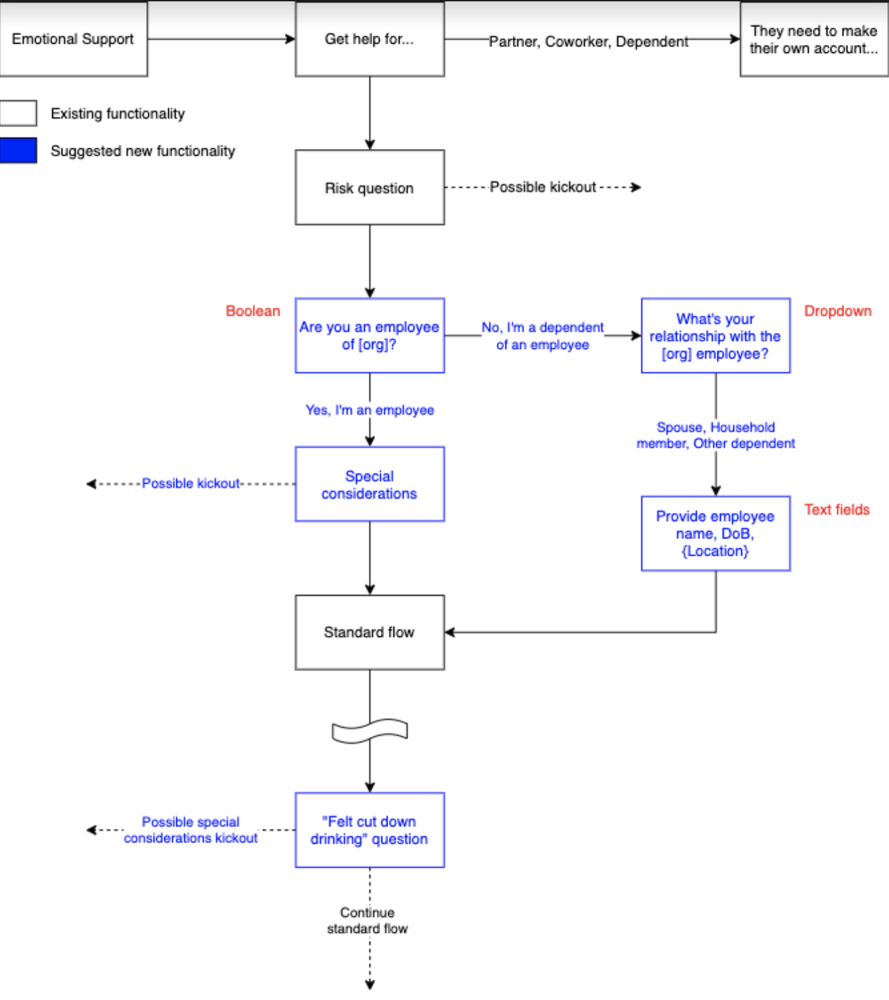

# Architecture Decision Records for Beacon

###### Prepared for Internal
###### Prepared by Sanyam Khurana
###### Updated on 22 Feb, 2022

There are numerous places in the codebase where an odd workflow is followed especially to overcome deficiencies in the API calls provided by third-party services such as MDLive.

### User provider search

MDLive allows doctors to be searched only by a registered user. Since we provide a search for doctors even before the user is registered, we do this search using a single anonymous user account on MDLive whose sole purpose is to do searches before an actual user is registered.

### MDLive get token also creates/updates user accounts

MDLive has a single API call that is used to retrieve a token to do subsequent calls to them. This call is a bit strange, as it takes all the data of the user and then depending on the uniqueness of four to five user attributes, determine if this was an existing user or an old one. Neither do they have an identifier on their end for a user nor do they reveal on which combination of five attributes they rely on.

Thus, this API call can be used to update or create a new user besides just the generation of the token.

To determine if MDLive updated an existing user, we generally query our DB from Django to see if the user with `mdlive_id` exists. This `mdlive_id` is returned in this same API call along with the token.

### Questionnaire intricacies

The rationale behind the changes in the database models and how questionnaire flow evolved can be seen in [questionnaire flow](./decision_records/questionnaire_flow.md).
- Each `questionnaire.Question` defines the next & previous questions which together forms the questionnaire flow.
- Here is the image of the questionnaire flow in the app:

[Diagram source on GDrive here](https://drive.google.com/file/d/1vztq99ieZ2DT_p6RE6CXZQShg9ryR20M/view)

- There is a generic questionnaire flow as well as the flow that is specific for some organizations.
- The custom flow according to the answers provided by the user can jump onto a question either from generic or custom questionnaire flow.
- This custom questionnaire flow is implemented via Template type in the questions using `organisations.IntakeQuestionTemplate` model. This template can be assigned to an organization which in turn determines the flow of questions to be displayed to the user trying to register for this organization.
- There are two types of templates created in Beacon using `load_initial_templates` management command. One is the default template and another one is the `Safety Sensitive Template`. These templates are assigned separate questions with each question having a next and previous question linked except the terminal questions.
- There was a separate flow made specifically for a truck-driving company, where consumption of alcohol by truck drivers could have serious implications on the business. We have a `Felt cutdown drinking` question which is asked twice in the flow using `Safety Sensitive template` and then also in the `chief_complaint` field.
- `user_response_attribute` in the `Question` model determines the attribute in the `answers.UserResponse` model where the answer to a particular question should be saved.
- `user_appointment_attribute` is similar to `user_response_attribute`, but it updates attributes of `answers.UserAppointment` model.
- `answers.UserResponse` has a one-to-one mapping with the user and is saved only during the initial onboarding flow.
- `answers.UserAppointment` contains extra attributes specific to each separate appointment created by the user. This will be asked multiple times, each time when the user tries to create an appointment.
- We duplicated the `appointment_state` inside the `answers.UserAppointment` from `answers.UserResponse` recently to maintain the history of `appointment_state` when the initial appointment was created. This is because now users will be allowed to update their `appointment_state` via API calls and that could've caused the `appointmetnt_state` in historic appointments to be updated as well. We avoid this issue by keeping a copy of `appointment_state` in `answers.UserAppointment`.
- `answers.UserResponse` has a `response` attribute that stores the entire JSON dumped by FE via API call. There are service functions that then parse the questions and their responses and determine which particular attribute is to be populated. Check `answers.services.set_attribute_from_response` for details.

### SSL configuration for prod server

On Dev/QA/Staging environment, SSL certificates are managed by LetsEncrypt, but for prod and pre-prod, these certificates are generated and issued by Beacon IT team. This is a wildcard certificate that applies to the domain and all the sub-domains. Once it is provided by the Beacon IT Team to Fueled, it is uploaded by Saurabh (Web-Engineering Director at Fueled) using AWS ACM on the load-balancer.

### Data sync to Beacon's connect system

- Only F2F appointments are synced with the `Beacon's connects` system.
- We maintain a user attribute `connects_mbr_id` that refers to the external id of the user, but this is directly entered manually by the BWB staff and never gets synced anywhere.

### Messaging system (attachments)

- Attachments during a chat between doctors and patients have caveats which can be found in [Message attachments flow](./decision_records/message_attachments_flow.md).

### Environments

Four environments are maintained namely Dev, QA, Staging, and Prod.

- For Dev/QA environments, FE is deployed separately on netlify by a FE dev.
- For staging / Prod, since they are on Amazon gov servers, the process of FE deployment is automated. If the staging/prod branch is pushed by FE, upon subsequent BE deployment, all FE changes will be made live.

### System services / monitoring and debugging

In case of issues on prod server the following guide can be used for checking status of the services, restarting them, or analysis of logs.

[Services information](./services_info.md)

### Bulk user deactivation through organisation deactivation

An organisation's deactivation causes all child-organisations to deactivate as well as all the users within these organisation to become inactive.

The re-activate feature has some caveats which are listed in [Bulk Organisation Deactivation/Reactivation flow](./decision_records/bulk_organisation_user_deactivation.md)

### Secrets Management

__NOTE__: This has been deprecated and not used anymore.

<strike>
Beacon stores the secrets for all environments using `.env` file. These file are encrypted and kept as part of the Github Repo which are then picked-up by Github Actions CI to decrypt these secrets file using AWS KMS and send it to the targeted server. All the caveats are documented at [Secrets Management](./decision_records/secrets_management.md)</strike>

### Read-only Django-admin view of Users

[Django admin read only view through ReadOnlyProxyUser model](./decision_records/django_admin_read_only_users.md)

### Deployment through Github Actions CI

Travis is deprecated and now Github Actions is used for CI/CD and manual deployment.
[Details here](./decision_records/github_actions.md)

### SCC & BWB Sync

Data is synced between BWB and SCC. The caveats and decisions regarding these are [documented here](./decision_records/scc_sync.md)

### Character fields with `null=True`

Character fields with `null=True` make sense only if we want to distinguish between `null` and "" (blank). But there are
various fields found in BWB system with `null=True` where it doesn't make sense. The problem and decision made right now
is [documented here](./decision_records/character_fields_with_null_true.md)
