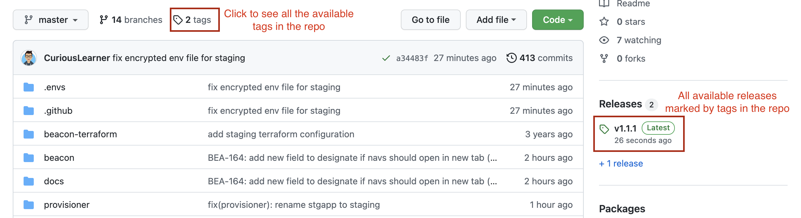
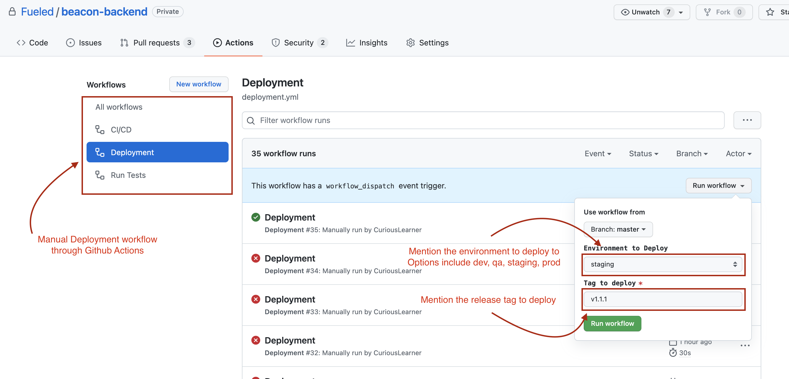

## Beacon | Github Actions
###### Prepared for Internal
###### Prepared by Sanyam
###### Updated on 21 January 2022

Travis was deprecated in this project in favor of Github Actions as it is cheaper, more-reliable and supports nicer integration with projects hosted on Github.

We utilize Github Actions to provide automated as well as manual deployment to all the environments present in the project.

### Beacon Deployment Steps through Github Actions

Fueled will mark releases with the help of git tags. Each release tag is marked with semantic versioning.

We’ll discuss the deployment of backend code. The same steps can be replicated for the frontend code. The deployment is set up via GithubActions and linked to the repo on GitHub. Each release is indicated by a tag.

In the picture below you can see all available tags in the repo as well as all the releases in the repo.

The latest release is indicated on the right-hand side. We can copy this tag and use it for deployment.

Click on the `Actions` tab from the menu at the top.

In the Actions tab, we can see all the workflows on the left side panel.

There are three workflows listed currently.

- CI/CD workflow is the auto-deployment based on git push to different branches.
- Deployment workflow is the manual workflow based on the environment to deploy to and the release version to deploy to. This workflow runs the server setup as well as deployment steps that ensures any configuration changes are also updated with this manual trigger.
- Run Tests workflow is automated to run all the tests on each individual push of commits for Continuous Integration.

The Deployment workflow can be executed by clicking on the Run workflow button on the right-hand side (as shown in the figure above). The workflow can be used from the master branch and then we can select the environment to deploy to (this will be prod). We can then select the version to deploy (this can be the latest version shown on the `Code` tab of the repo).

In the first image, we can see the latest version is v1.1.0 which is used in the second image to trigger the deployment. We can click on `Run Workflow` and see detailed logs of the deployment by clicking on them. A green checkmark will appear when the deployment is successful.
